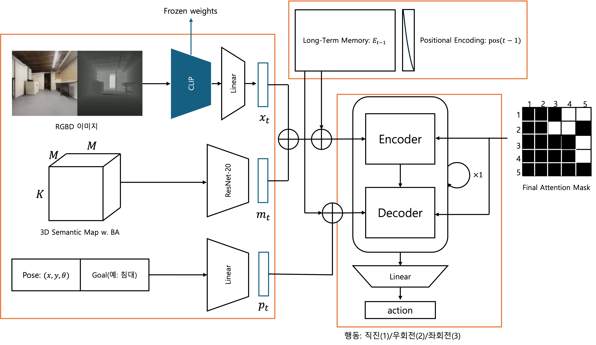

# SemEmb: KHU Robot-Vision Capstone Design Project
-----
This repository is for Robot Vision Capstone Design Project in KyungHee Univ. 2024 spring semester  
Our model's Architecture is like:  
 <br />

This repository contains:
- SemEmb train & evaluation code
- Docker file for SemEmb and Habitat simulations 

## Install dependencies with Docker 
-----

To install dependencies for SemEmb, we can use docker.

1. Build Docker image (docker image tag for $version): 

```
bash buid_dimage.sh $version
```

2. run docker container:

```
bash run_docker_con.sh
```

After run docker container, you can access container with command below:

```
sudo nvidia-docker exec -it <container name> /bin/bash
```


## Training
-----

To train & evaluate SemEmb, you can use following scripts

- Train

```
CUDA_VISIBLE_DEVICES=0,1 python3 train.py -n 1 --auto_gpu_config=0 --num_global_steps=5 --num_mini_batch=3 --exp_name=<experiment name>
```

Arguments descriptions:  
- n: number of process for Habitat simulator (batch size)
- auto_gpu_config: turn on/off GPU auto configuration (0 for off, 1 for on)
- num_global_steps: Number of timesteps for transformer
- num_mini_batch: PPO's minibatch size
- exp_name: experiment tag (result will be saved in following path)

- Evaluation

```
CUDA_VISIBLE_DEVICES=0 python3 train.py --split val --eval 1 --load <checkpoint path> -n 1 --auto_gpu_config=0
```

Argument descriptions:  
- split: dataset type(train/validation)
- eval: turn on the evaluation mode
- load: mode checkpoint path
- n: number of process for Habitat simulator (batch size)
- auto_gpu_config: turn on/off GPU auto configuration (0 for off, 1 for on)

## Database setup
-----

We use gibson dataset for this study. Gibson dataset is avaliable in the [link](https://github.com/facebookresearch/habitat-lab#scenes-datasets).  
Download the Gibson dataset using the instructions in the link.

- Setting up datasets

The code requires the datasets in a specific folder in the following format (same as habitat-lab):  

```
data/
  scene_datasets/
    gibson_semantic/
      Adrian.glb
      Adrian.navmesh
      ...
  datasets/
    objectnav/
      gibson/
        v1.1/
          train/
          val/
```

You can set the dataset path for 'data' directory with docker container volume mount.

## Related Projects
- This project builds on the [Active Neural SLAM](https://devendrachaplot.github.io/projects/Neural-SLAM) paper. The code and pretrained models for the Active Neural SLAM system are available at:
https://github.com/devendrachaplot/Neural-SLAM.
- The Semantic Mapping module is similar to the one used in [Semantic Curiosity](https://devendrachaplot.github.io/projects/SemanticCuriosity).

## Acknowledgements
This repository uses [Habitat Lab](https://github.com/facebookresearch/habitat-lab) implementation for running the RL environment.
The implementation of PPO is borrowed from [ikostrikov/pytorch-a2c-ppo-acktr-gail](https://github.com/ikostrikov/pytorch-a2c-ppo-acktr-gail/). 
The Mask-RCNN implementation is based on the [detectron2](https://github.com/facebookresearch/detectron2/) repository. We would also like to thank Shubham Tulsiani and Saurabh Gupta for their help in implementing some parts of the code.
